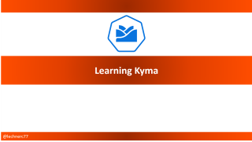

# Learning Kyma 

## Motivation
In general the world of extending SAP solutions has become more diverse over the last years. In the "old days" dev-life was easy with respect to deciding on how and where to extend SAP solutions. This has changed over the last years and side-by-side extensions gained some traction especially as we should "keep the core (c)lean."
Although I personally do not like this mantra as it can guide in the wrong direction, I am convinced that depending on the business scenario and its requirements side-by-side extensions can add incredible value. 
However, going down that path puts some decision making up in front of us. The SAP ecosystem per se offers the SAP Cloud Platform as technological basis for this type of extensions. But on this platform you have several runtimes to build and operate side-by-side extensions namely:
* [Application runtime](https://discovery-center.cloud.sap/serviceCatalog/257fac1c-88aa-415b-8ea8-c96282c9a19b) (aka Cloud Foundry)
* [Serverless runtime](https://discovery-center.cloud.sap/serviceCatalog/731e36df-863f-49f7-9b15-dd6dc9ffc60b) (basically a managed Knative offering)
* [Kyma runtime](https://discovery-center.cloud.sap/serviceCatalog/1b320a69-c013-417c-bf55-2683299777c6) - a managed [Kyma](https://kyma-project.io/) environment 
* [ABAP environment](https://discovery-center.cloud.sap/serviceCatalog/0ad55771-a533-4d25-a4dd-e3d8b1ffa4f6) (aka Steampunk)

In my opinion Steampunk is a different kind of competitor when it comes to extensions. I definitely see the value of this runtime, but the target audience with respect to business scenarios as well as developers is quite different to the other options and, hence, I will not discuss it further.

Leaving Steampunk aside which area should we focus on? My personal favorite and recommendation is [Kyma](https://kyma-project.io/) because:
* It is fully Open Source based and contributes back 
* The technology stack embraces a rich and vibrant ecosystem in the [cloud-native universe](https://www.cncf.io/) 
* Development is platform agnostic ("sustainability" of SCP environments and runtimes caused some headaches to customers in the past - this risk is mitigated)
* Broadest functional scope from Function-as-a-Service to microservices, from extensions to complete applications

Now the next question we must ask is: how to get started? 
Well here is my offer: I will publish my learnings about Kyma as videos on YouTube from zero to ... wherever this journey will take me and you can follow along. 

(As a background: I got in touch with Kyma in its quite early stages but somehow did not dig intensively into it basically because of the poor experience of local development on a windows machine and no work project in that area. Now the game has changed as the managed offering on SAP Cloud Platform is available on trial and it is time to hit the refresh button and start the learning journey.)   

## Why another resource on that topic?
To be honest there is quite some information out there starting from the official documentation of the Kyma project to several blogs in the SAP Community to tutorials on [developers.sap.com](https://developers.sap.com/tutorial-navigator.html). I will not reinvent the wheel and pick up some of these assets for my learning path but from my experience the tutorials give you a clear guidance on how to get things running and if something goes wrong you are lost. This is good as you get started without too much frustration, but I often miss the explanation on what happens behind the scenes and why this is the case and why some things were done as presented. From my experience that is okay for a quick start but if you hit real life scenarios a decent understanding of the mechanics is essential. I hope I can achieve this with my contributions ... we will see 🧐

## When will content by published?
I aim to publish episodes regularly. Whenever a new episode is available I will push out the update on:
* [YouTube](https://www.youtube.com/channel/UCeaAZSNyP3MbyGe_1KKZADA?view_as=subscriber)
* [Twitter](https://twitter.com/lechnerc77)
* [LinkedIn](https://www.linkedin.com/in/christian-lechner-963b7017)
* [This repo](https://github.com/lechnerc77/learningKyma)

So follow me on any of the above channels (or on all of them 😏) and you will get notified...

## Overview of Episodes (planned)
This is the current plan for my journey with Kyma: 

| Episode        |  GitHub  | YouTube | 
|----------------|-----------|-----------|
| 0              | [Introduction & Prerequisites](https://github.com/lechnerc77/learningKyma/blob/main/episode0/Episode0.md) | [Link](https://youtu.be/wqQflgmyboY) |
| 1              | [Setting Up Managed Kyma & Kubernetes/Kyma Basics](https://github.com/lechnerc77/learningKyma/blob/main/episode1/Episode1.md) | [Link](https://youtu.be/uhkbbH7oS5g) |
| 2              | [Deploying a sample app](https://github.com/lechnerc77/learningKyma/blob/main/episode2/Episode2.md) | [Link](https://youtu.be/ypRgpicgqqQ) |
| 3a             | [Deploying an Azure Function to Kyma](https://github.com/lechnerc77/learningKyma/blob/main/episode3/Episode3.md) | [Link](https://youtu.be/Jr4QHOq_XvI) |
| 3b             | [The Horizontal Pod Autoscaler and KEDA](https://github.com/lechnerc77/learningKyma/blob/main/episode3/Episode3.md) | [Link](https://youtu.be/wH2rIADfdoE) |
| 3c             | [Cleaning up Ressources](https://github.com/lechnerc77/learningKyma/blob/main/episode3/Episode3.md) | [Link](https://youtu.be/VIWW4Si5Sa8) |
| 4              | [Install Commerce Mock & Create Function Extension](https://github.com/lechnerc77/learningKyma) | TBD |
| 5              | [Securing your endpoints via OAuth](https://github.com/lechnerc77/learningKyma) | TBD |
| 6              | [Consuming resources via Open Service Broker](https://github.com/lechnerc77/learningKyma) | TBD |
| 7              | [Scaling and Autoscaling](https://github.com/lechnerc77/learningKyma) | TBD |
| 8              | TBD | TBD |

So let us get the journey started 🚀

## How to give feedback and contribute?
Certainly I will miss things or maybe overlook something. I am happy to receive feedback via issues in this [GitHub repository](https://github.com/lechnerc77/learningKyma). You can also propose new topics this way.

## Detour - There is more than black and white
To make one thing clear: I am 100% sure that restricting yourself to the SAP ecosystem in case of side-by-side extensions is the wrong way in most cases. The magic will happen when combining the offering of SAP together with the PaaS offering of hyperscalers (and my preference with respect to hyperscalers is clear I guess if you look at some of my blog posts 😁). My videos will reflect this.

I would even state that there are valid use-cases for side-by-side extension as I have highlighted in this [blog](https://blogs.sap.com/2019/12/09/a-serverless-extension-story-from-abap-to-azure/). It is the business value and not the technology that you should focus on when it comes to extensions. But that is a different discussion.